# 👨🏻‍💻 Kaique Alves Mesquita

**`Desenvolvedor Backend Full Stack`**


<br>

<p align="left">
  <a href="SEU_LINK_DO_LINKEDIN">
    
  </a>
  &nbsp;&nbsp;
  <a href="mailto:kaiquealvesmesquita@gmail.com">
    
  </a>
</p>

<p align="left">
  
  &nbsp;
  
  &nbsp;
  
  &nbsp;
  
  &nbsp;
  
  &nbsp;
  
  &nbsp;
  
  &nbsp;
  
  &nbsp;
  
  &nbsp;
  
  &nbsp;
  
  &nbsp;
  
  &nbsp;
  
  &nbsp;
  
</p>

---

### Sobre mim

Sou de **Sorocaba/SP**, formado em **Análise e Desenvolvimento de Sistemas pela Fatec Sorocaba** e atualmente curso **Engenharia da Computação na Univesp**.

Tenho foco em desenvolvimento **Backend com Java e Spring Boot**, além de experiência com desenvolvimento Full Stack, bancos de dados e aplicações web.

Possuo experiência prática com **Java, Spring Boot, Angular e PostgreSQL**, atuando em desenvolvimento, integração, modelagem e persistência de dados e implantação de aplicações.

Atualmente busco oportunidades como **Desenvolvedor Backend Java Júnior**, **Desenvolvedor Full Stack Júnior** ou **Estagiário em Desenvolvimento de Software**.

---

### 📊 GitHub

<p align="left">
  

  
</p>

---

### 🎓 Formação

**Engenharia da Computação**  
Univesp — Cursando

**Análise e Desenvolvimento de Sistemas**  
Fatec Sorocaba — Concluído em 2025

**Técnico em Desenvolvimento de Sistemas**  
ETEC Fernando Prestes — Concluído em 2023

---

### ☁️ Cloud

**AWS Academy Cloud Foundations** • **AWS Academy Cloud Developing**
```
